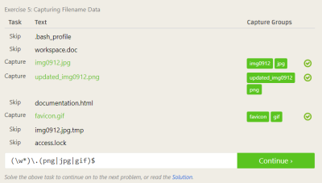

# Lab 01 Report - Introduction to Open Source Software

## Section 1

***

## Section 2
### **1**
The article gave me better insight on the specific defintions of what it means for a program to be open source. Some rules are very self-explanatory such as the no discrimination rule while others such a rule 7 (Distribution of License), I had not explicitly heard of. This rule means that the rights of a project must be used on all other redistributions.

### **2**
This reading helped me better understand the process of asking a programming-related question on the net. One key aspect that I found interesting when asking a question on a site like Stack Overflow, is first showing the work you did to try and find an answer; this will make other programmers more willing to help and answer the question. Another important thing to note is that large blocks of code should not be posted in most cases.

### **3**
* After answering the question, include some additional resouces that the asker may want to read up on to gain more knowledge on the question subject.
* Be polite when it is evident that the asker is new to the field and stern when they have been exploitative of the system multiple times.

### **4**
My overall reaction to reading Chapter 3 of Free Culture was "upset". I was upset at the RIAA for having a such a seemingly harmful overreaction to Jesse's innocent search engine project. Despite my initial reaction, it is important to recognize the time at which this case took place, 2002. At this time, I believe that the term open source had just recently been coined (in 1998) and was probably unheard of by most people. Despite the case's age, it is important to note that this event emphasizes the importance of open source software back then, and modern day. Jesse simply innovated an existing software project to fit the needs of his community--i.e. his work had a net-postive impact on the world, and he was subsequently punished for it. If the search engine code had an open source license this this would not have happened and maybe companies like Microsoft and Google could even benefit from these changes. An example of this being evident is when Jesse even fixed a bug in Microsoft's code. If these large companies and small developers worked together instead of generating lawsuits then I believe that this would only benefit both parties.

### **5**
The first chapter of this book surprised in the fact of how small the codebase required to do basic Regex matching is. The code displayed in this chapter was succinct and used the idea of recursion to its advantage.
***

## Section 3

***

## Section 4
### **1**

### **2**

***

## Section 5

***

## Section 6
After looking through the list of open source projects, I chose the Continuous Integration System project to look at (https://aosabook.org/en/500L/a-continuous-integration-system.html). I thought this project looked interesting because it is relatively small in code size which means it can do a lot in a small amount of lines. I also am interested in the continious integration itself due to using in in various forms when working during my internships.

A problem for this project that could be tackled is that of the Test Runner manager which is in charge of distributing test runners based on the number of requests and tests being run. Another potentially interesting addition could be a UI to manage, administrate and view running proccesses in the system.
