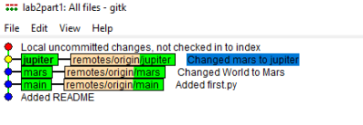
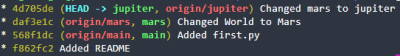
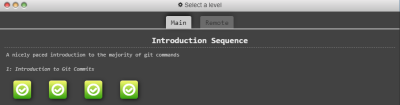
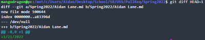
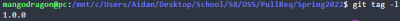

# Lab 02 Report - Introduction to Open Source Software

## Part 1
https://github.com/aidan-lane/oss-lab2-part1

```
gitk --all
```



```
git log --graph --oneline --decorate
```


***

## Part 2

https://github.com/aidan-lane/Spoon-Knife


***

## Part 3

https://github.com/aidan-lane/PullReq

```
diff
```


```
tag list
```


https://github.com/lhain08/OSSProjectIdeas