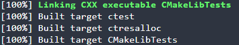
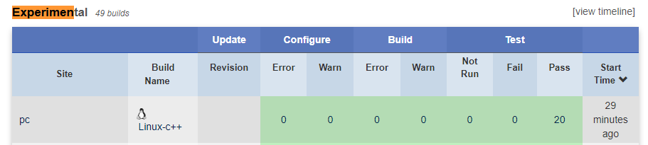
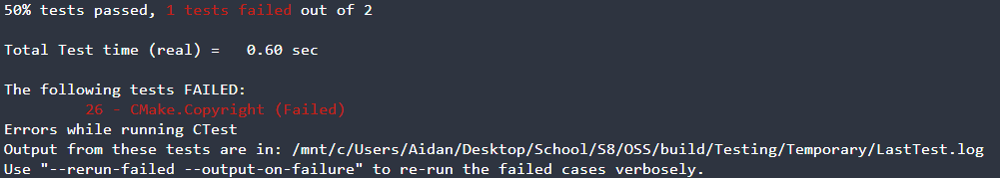
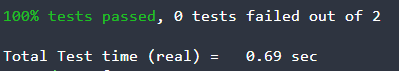
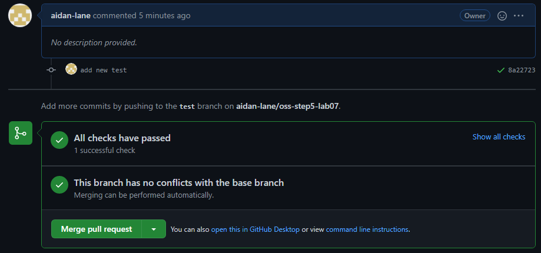
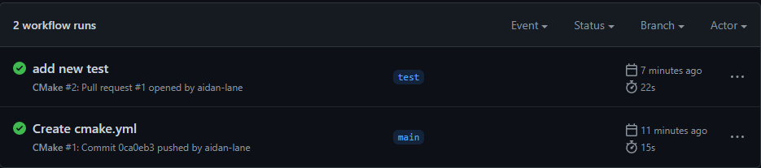

# Lab 07 Report - Introduction to Open Source Software

## Checkpoint 1
**Build complete message:**\

## Checkpoint 2
- You can check test details for nightly and experimental by clicking on the test coolumn
for a specific build
- You can check the error condition by clicking on the failed test and then clicking on the name of the failed test. For a nightly build, we can see that the error was: "stderr does not match that expected."
- I chose the build: "Linux-Gentoo-Sparc32-gcc4.9". The dashboard is relatively clean. There is one error listed under tests. This error is under the test "RunCMake.CompatibleInterface".

## Checkpoint 3

- The command shows the number and name of the test that failed.

`Failed output:`

- This is an issue with the Copyright file's specified year. 2020 should be changed to 2022 (the current year).

`After fixing:`

## Checkpoint 4
https://github.com/aidan-lane/oss-step5-lab07

## Checkpoint 5
N/A

