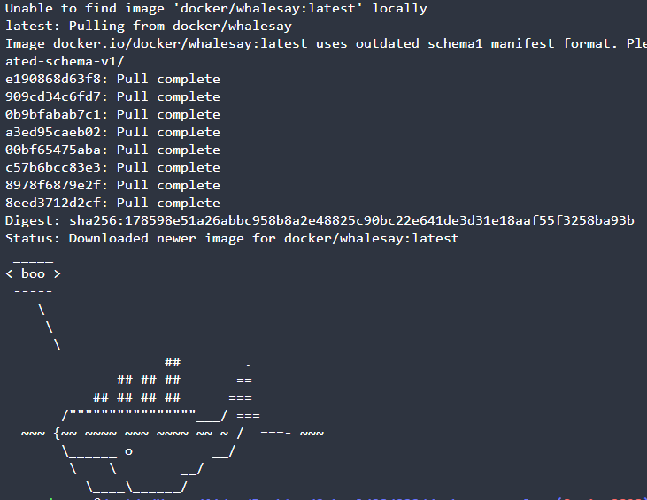
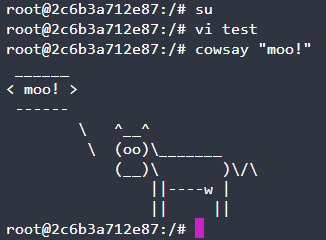
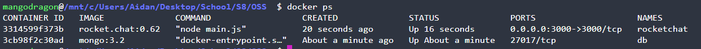
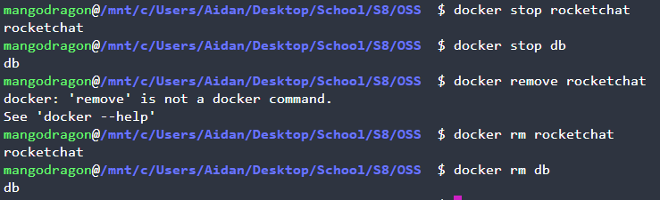
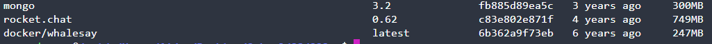
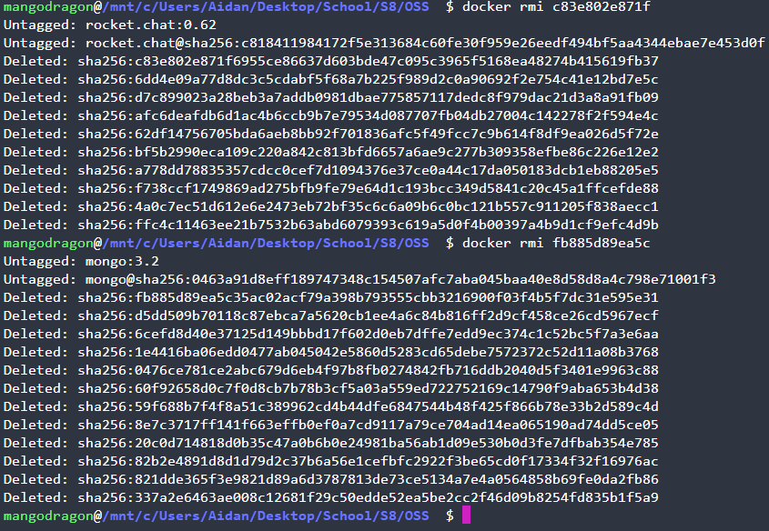
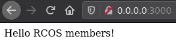

# Lab 08 Report - Introduction to Open Source Software

## Example 00

***

## Example 01

Here you can see the command `vim test` runs succesfully, and cowsay outputs:


***

## Example 02
`docker ps`:



Stopping and removing containers:



`docker images`:



Removes images:


***

## Example 03
After building and running:


***

## Example 04
`Dockerfile`:
```
FROM node:10.15.3
ENV LAST_UPDATED 20190325T175400

# Copy source code
COPY . /app

# Change working directory
WORKDIR /app

# Install dependencies
RUN npm install

# Fix up some of the issues
RUN npm audit fix

# Expose API port to the outside
EXPOSE 1337

# Launch application
CMD ["node","app.js"]
```

`docker-compose.yml`:
```
version: '3'
services:
  mongo:
    image: mongo:4.0.7
    volumes:
      - mongo-data:/data/db
    expose:
      - "27017"
  app:
    build: .
    ports:
            - "1337:1337"
    links:
      - mongo
    depends_on:
      - mongo
    environment:
      - MONGO_URL=mongodb://mongo/messageApp
volumes:
  mongo-data:
```


Terminal output after running all example commands:
```
mangodragon@/mnt/c/Users/Aidan/Desktop/School/S8/OSS  $ curl -XPOST http://localhost:1337/message\?text\=hello
{
  "text": "hello",
  "createdAt": 1648174248534,
  "updatedAt": 1648174248534,
  "id": "623d24a88ec81b5cda000b89"
}%                                                                                                                                                                                mangodragon@/mnt/c/Users/Aidan/Desktop/School/S8/OSS  $ curl -XPOST http://localhost:1337/message\?text\=hola
{
  "text": "hola",
  "createdAt": 1648174267841,
  "updatedAt": 1648174267841,
  "id": "623d24bb8ec81b10bf000b8a"
}%                                                                                                                                                                                mangodragon@/mnt/c/Users/Aidan/Desktop/School/S8/OSS  $ curl http://localhost:1337/message
[
  {
    "text": "hello",
    "createdAt": 1648174248534,
    "updatedAt": 1648174248534,
    "id": "623d24a88ec81b5cda000b89"
  },
  {
    "text": "hola",
    "createdAt": 1648174267841,
    "updatedAt": 1648174267841,
    "id": "623d24bb8ec81b10bf000b8a"
  }
]%                                                                                                                                                                                              
mangodragon@/mnt/c/Users/Aidan/Desktop/School/S8/OSS  $ curl -XPUT http://localhost:1337/message/623d24a88ec81b5cda000b89\?text\=hey
{
  "text": "hey",
  "createdAt": 1648174248534,
  "updatedAt": 1648174344310,
  "id": "623d24a88ec81b5cda000b89"
}%                                                                                                                                                                                mangodragon@/mnt/c/Users/Aidan/Desktop/School/S8/OSS  $ curl -XDELETE http://localhost:1337/message/623d24bb8ec81b10bf000b8a
{
  "text": "hola",
  "createdAt": 1648174267841,
  "updatedAt": 1648174267841,
  "id": "623d24bb8ec81b10bf000b8a"
}%                                                                                                                                                                                                               
mangodragon@/mnt/c/Users/Aidan/Desktop/School/S8/OSS  $ curl http://localhost:1337/message
[
  {
    "text": "hey",
    "createdAt": 1648174248534,
    "updatedAt": 1648174344310,
    "id": "623d24a88ec81b5cda000b89"
  }
]%                                                                                                                                                                                                               
mangodragon@/mnt/c/Users/Aidan/Desktop/School/S8/OSS  $
```
***
